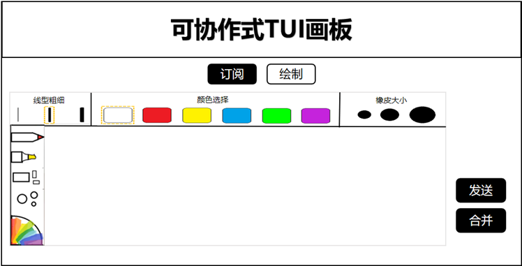

# 可交互式TUI画板

1.绘制页面：页面顶部居中标明产品名称，接下来居中放置两个按钮，实现订阅页面和绘制页面的切换。主体部分是一个画板，提供用户作画区。画板上部呈现常用的线型粗细、颜色选择和橡皮大小切换模块，均辅以文字说明帮助初次进入的用户快速上手，且颇为细心的适配左、右手使用习惯，将其中最常用的颜色选择模块置于中央；考虑到大部分使用者的右手习惯，在画板左侧放置笔形选择和常用图形绘制功能。画板以外设置发送与合并按钮，将和订阅模块协同作用。

2.订阅页面：页面顶部居中标明产品名称，接下来居中放置两个按钮，实现订阅页面和绘制页面的切换。页面左侧是订阅主题的板块，在输入框中输入主题的名字，即可订阅该主题，订阅后的主题会出现在列表当中，供用户进行屏蔽、取消订阅和选择。页面右侧适配系统的操作步骤，首先呈现设置、连接、断开和显示最新消息的按钮，接着是图像显示模块，在该处用户可以看到该主题下的最新消息或是多个主题绘制的合并结果。

**实现的需求：**

1. 手势识别

2. 不同颜色，不同粗细，不同画笔线条的绘制

3. 绘制矩形、圆形等基本图形

4. 订阅主题会议室进行线上交互。
